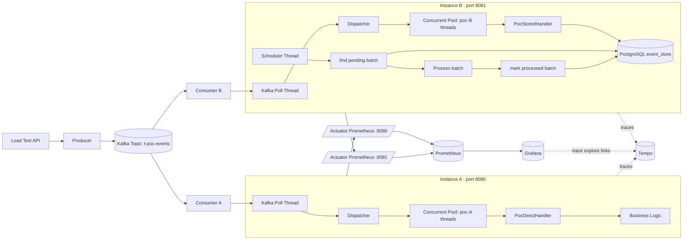

# EventFlow POC 测试方案架构图（A vs B）

## 1) 总体架构

## 2) 对比口径（本次测试）

- 同一 Kafka Topic，不同 `group-id`，A/B 独立消费互不抢分区。
- A 策略：消息到达后直接执行业务处理。
- B 策略：先落库，再由调度器异步处理并回写状态。
- B 落库策略：以 Kafka 单次 `poll` 实际拉取条数为批次边界，批量同步写库。
- 观测面：
  - Metrics：Prometheus + Grafana（E2E Avg/P50/P95、吞吐、B DB操作统计）
  - Trace：Tempo（可区分 send/process/store/scheduler/DB 阶段）

## 3) 关键指标映射

- A/B E2E 延迟：`poc_e2e_duration_seconds_*`
- A/B 吞吐：`poc_events_processed_total`（配合 `increase/rate`）
- B DB 操作次数：`poc_db_operation_total{strategy="B"}`
- B DB 操作耗时：`poc_db_operation_duration_seconds_{sum,count,bucket}{strategy="B"}`
