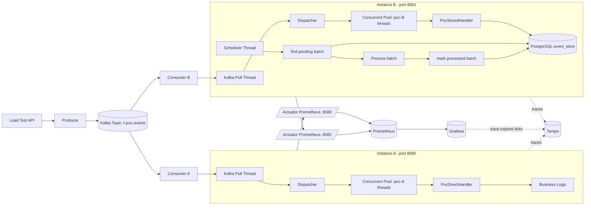

# EventFlow POC 测试方案架构图（A vs B）

## 1) 总体架构

## 2) 对比口径（本次测试）

- 同一 Kafka Topic，不同 `group-id`，A/B 独立消费互不抢分区。
- A 策略：消息到达后直接执行业务处理。
- B 策略：先落库，再由调度器异步处理并回写状态。
- B 落库策略：以 Kafka 单次 `poll` 实际拉取条数为批次边界，批量同步写库。
- 观测面：
  - Metrics：Prometheus + Grafana（E2E Avg/P50/P95、吞吐、B DB操作统计）
  - Trace：Tempo（可区分 send/process/store/scheduler/DB 阶段）

## 3) 关键指标映射

- `Overall E2E Avg (ms)`（A/B 总体平均端到端耗时）
  - 指标：`poc_e2e_duration_seconds_sum`、`poc_e2e_duration_seconds_count`
  - 推荐 PromQL：`sum by(strategy)(increase(poc_e2e_duration_seconds_sum[5m])) / sum by(strategy)(increase(poc_e2e_duration_seconds_count[5m])) * 1000`
  - 含义：发送时间戳到“处理完成”的平均耗时，窗口内均值（不是全量历史均值）。

- `Overall E2E P50/P95 (ms)`（A/B 中位数和长尾）
  - 指标：`poc_e2e_duration_seconds_bucket`
  - 推荐 PromQL（P50）：`histogram_quantile(0.5, sum by(le,strategy)(increase(poc_e2e_duration_seconds_bucket[5m]))) * 1000`
  - 推荐 PromQL（P90）：`histogram_quantile(0.9, sum by(le,strategy)(increase(poc_e2e_duration_seconds_bucket[5m]))) * 1000`
  - 推荐 PromQL（P95）：`histogram_quantile(0.95, sum by(le,strategy)(increase(poc_e2e_duration_seconds_bucket[5m]))) * 1000`
  - 推荐 PromQL（P99）：`histogram_quantile(0.99, sum by(le,strategy)(increase(poc_e2e_duration_seconds_bucket[5m]))) * 1000`
  - 含义：
    - P50：50% 请求不超过该耗时（常态体验）。
    - P90：90% 请求不超过该耗时（大多数请求体验）。
    - P95：95% 请求不超过该耗时（尾延迟，容易受排队/抖动影响）。
    - P99：99% 请求不超过该耗时（极端慢请求，常用于容量和稳定性边界观察）。
  - 直观例子（假设 1000 条请求）：
    - P90=800ms：表示约 900 条 <= 800ms，最慢 100 条 > 800ms。
    - P95=1.2s：表示约 950 条 <= 1.2s，最慢 50 条 > 1.2s。
    - P99=2.8s：表示约 990 条 <= 2.8s，最慢 10 条 > 2.8s。

- `Throughput: A vs B (events/sec)`（A/B 吞吐）
  - 指标：`poc_events_processed_total`
  - 推荐 PromQL：`sum by(strategy)(rate(poc_events_processed_total[1m]))`
  - 含义：每秒处理速率；如果看“近 5 分钟处理总量”，用 `increase(...[5m])`。

- `B 处理总条数`（看板里近窗口累计）
  - 指标：`poc_events_processed_total{strategy="B"}`
  - 推荐 PromQL：`sum(increase(poc_events_processed_total{strategy="B"}[5m]))`
  - 含义：近 5 分钟内 B 实际完成处理的条数，不是启动以来总累计。

- `DB 操作总次数`（B）
  - 指标：`poc_db_operation_total{strategy="B"}`
  - 推荐 PromQL：`sum(increase(poc_db_operation_total{strategy="B"}[5m]))`
  - 含义：近 5 分钟内 DB 调用次数（含 `save/find_pending/mark_processed_batch` 等）。

- `DB 平均耗时 (5m)`（B）
  - 指标：`poc_db_operation_duration_seconds_sum`、`poc_db_operation_duration_seconds_count`
  - 推荐 PromQL：`sum(increase(poc_db_operation_duration_seconds_sum{strategy="B"}[5m])) / sum(increase(poc_db_operation_duration_seconds_count{strategy="B"}[5m])) * 1000`
  - 含义：单次 DB 操作平均耗时（毫秒）；若网络延迟或 DB 压力上升，会明显抬升。

- Trace 阶段映射（Tempo）
  - `poc.phase=store`：B 首段落库（Kafka -> DB）
  - `poc.phase=process`：A 直接处理 / B 调度处理
  - `poc.component=db|scheduler|business|outbound`：进一步拆分 DB、调度、业务、发送阶段耗时
