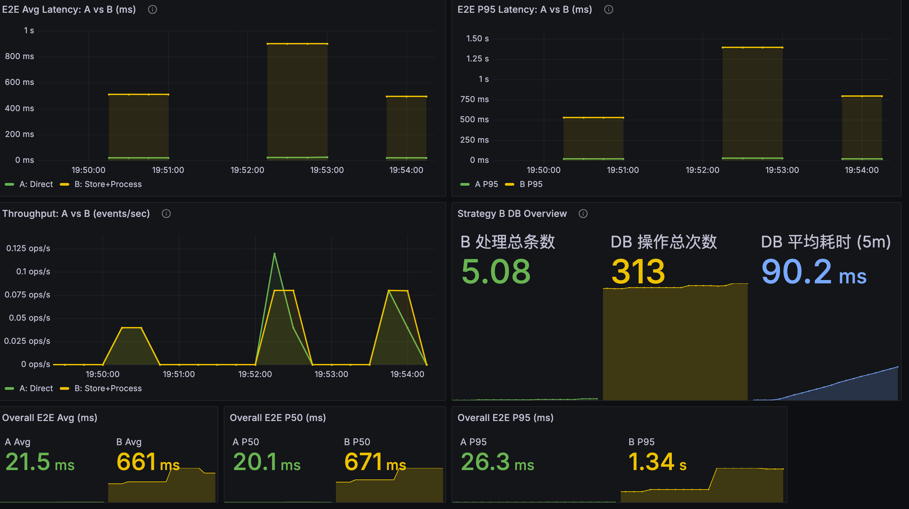
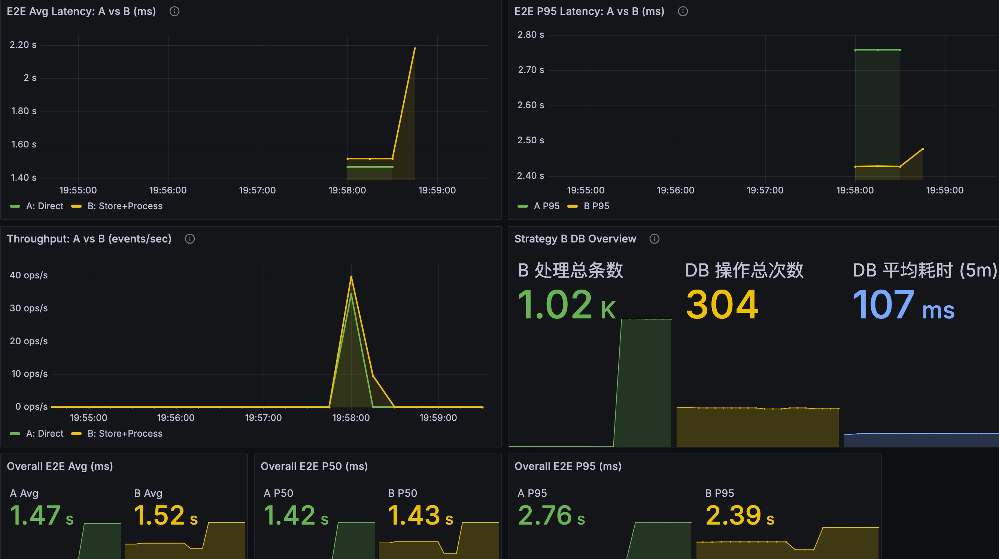
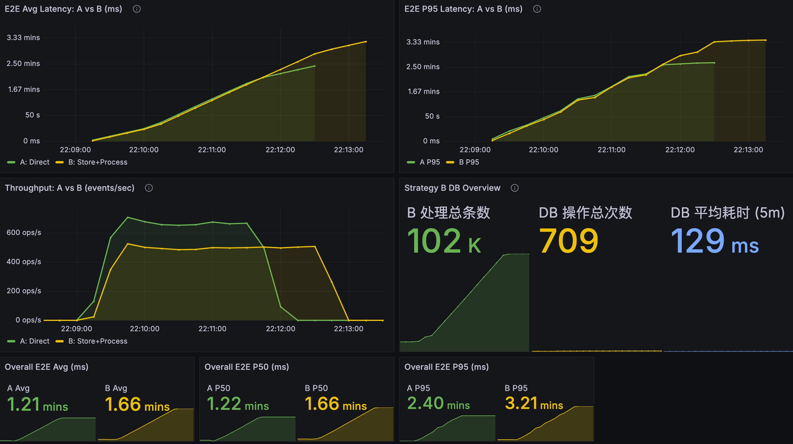
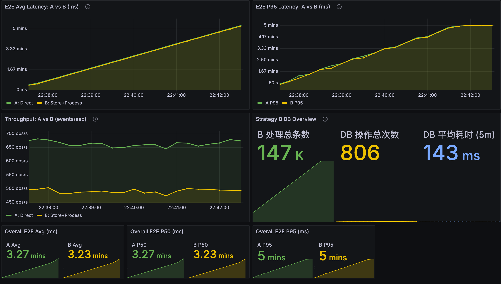
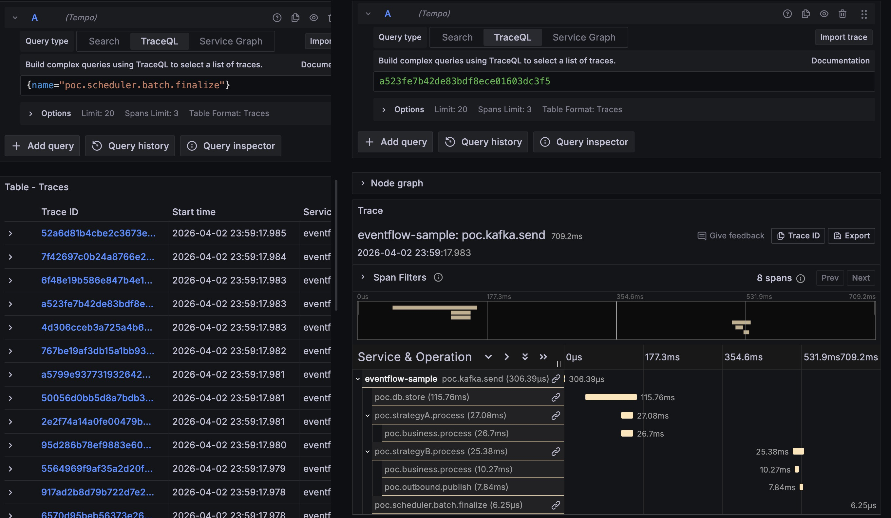
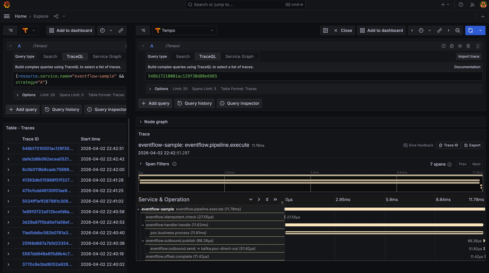
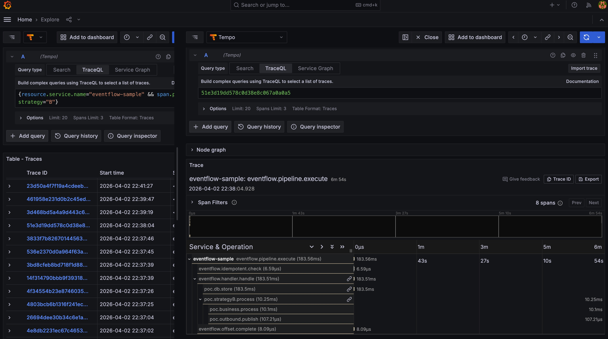

# POC 压测结果总结（A vs B）

## 合并结论（先看这个）

1. 整体上，A（Direct）延迟与吞吐都更稳定；B（Store + Process）在低负载时更容易被“落库 + 调度 + 回写”固定开销拉慢。
2. 在纯 POC 场景（DB 网络延迟 0ms）下，随着压力上升，B 相比 A 的延迟劣势会快速放大，分钟级高压时更明显。
3. 在仿真场景（业务 10ms + DB 网络延迟 100ms）下，A/B 的延迟差距相比纯 POC 明显缩小，但高压长跑下 B 吞吐仍低于 A，后段更易积压。
4. 仪表盘多数指标为 5 分钟窗口聚合；当测试还在进行时，A/B 的窗口均值可能短暂接近，但吞吐差会在后段反映为更高的平均耗时和尾延迟。
5. 可归纳为：业务处理延迟越高，A 与 B 的差距通常越小；但在持续高压下，B 仍更容易受 DB 与调度链路影响。

## 一致测试参数（所有测试都相同）

- 对比策略一致：A = `Direct`，B = `Store + Process`
- Kafka 主题与压测流程一致（A/B 独立消费）
- B 调度延迟一致：`1 s`
- 指标与统计口径一致：同一套 Grafana/Prometheus 面板，核心统计按 `5m` 窗口聚合

## 场景差异参数

- 原始 POC 4 轮：模拟 DB 网络延迟 = `0 ms`
- 仿真场景 4 轮：业务处理耗时 = `10 ms`，每次 DB 访问网络延迟 = `100 ms`（其余同原方案）

### 仿真场景相对之前的参数变更

1. 业务处理耗时：从原来的 `0 ms` 调整为 `10 ms`
2. DB 网络开销：设置为 `100 ms`（每次 DB 访问）

## 测试截图

> 图片均来自 `eventflow-sample/images/`。

### 第1轮（5次单次发送）

### 第2轮（1000条）

### 第3轮（10万条）

### 第4轮（超高压持续发送）

## 核心结果汇总

| 轮次 | 发送规模 | A Avg | B Avg | A P50 | B P50 | A P95 | B P95 | B处理总数 | B DB操作总次数 | B DB平均耗时(5m) |
|---|---:|---:|---:|---:|---:|---:|---:|---:|---:|---:|
| 第1轮 | 5次单条 | 15.2 ms | 604 ms | 15.0 ms | 582 ms | 21.0 ms | 872 ms | 5.08 | 348 | 1.61 ms |
| 第2轮 | 1000条 | 9.04 ms | 503 ms | 7.93 ms | 502 ms | 15.9 ms | 966 ms | 1.02k | 812 | 1.55 ms |
| 第3轮 | 100000条 | 5.88 s | 11.6 s | 5.63 s | 11.5 s | 10.7 s | 21.5 s | 102k | 1.08k | 24.3 ms |
| 第4轮 | 超高压持续发送 | 1.03 mins | 2.20 mins | 1.05 mins | 2.45 mins | 2.04 mins | 3.88 mins | 858k | 5.43k | 34.0 ms |

## 原始 POC 场景详细解读

1. 在低负载（第1轮、第2轮）下，A 延迟稳定在毫秒级，B 稳定在约 0.5~1 秒级，符合 B 依赖调度周期（1秒）的预期。
2. 在中高负载（第3轮，10万条）下，A/B 均进入秒级，且 B 约为 A 的 2 倍（Avg/P50/P95 均体现）。
3. 在超高压持续场景（第4轮）下，A/B 均进入分钟级，B 进一步高于 A（Avg 2.20 mins vs 1.03 mins，P95 3.88 mins vs 2.04 mins）。
4. B 的 DB 平均耗时随压力明显升高（1.55 ms -> 24.3 ms -> 34.0 ms），说明 DB 与调度链路在高并发下成为主要瓶颈来源。
5. 吞吐峰值随压力抬升（第3轮 A~4k/s、B~3k/s；第4轮 A~7k/s、B~5k/s），但延迟和排队快速放大，系统进入“高吞吐-高积压-高尾延迟”区间。

## 补充说明（口径）

- 图中 `B处理总数`、`DB操作总次数`、`DB平均耗时(5m)` 为近5分钟窗口聚合口径（按当前仪表盘定义）。
- 第1轮的 `B处理总数=5.08` 为窗口统计值，不是整数事件计数（属于速率/增量换算展示）。
- 第4轮为持续高压窗口，`B处理总数=858k` 为窗口统计值，不等同于单次请求固定发送总量。

---

## 仿真场景参数说明（相对之前）

1. 业务处理耗时：从 `0 ms` 调整为 `10 ms`
2. DB 网络开销：设置为 `100 ms`（每次 DB 访问）
3. 其他参数保持与原始 POC 测试一致

## 仿真场景截图与结果

> 图片目录来自 `eventflow-sample/images/sim-real.png/`（目录名保留不影响展示）。

### 仿真第1轮（sim-real-r1）

### 仿真第2轮（sim-real-r2）

### 仿真第3轮（sim-real-r3）

### 仿真第4轮（sim-real-r4）

## 仿真场景核心结果汇总

| 轮次 | A Avg | B Avg | A P50 | B P50 | A P95 | B P95 | B处理总条数 | DB操作总次数 | DB平均耗时(5m) |
|---|---:|---:|---:|---:|---:|---:|---:|---:|---:|
| 仿真第1轮 | 21.5 ms | 661 ms | 20.1 ms | 671 ms | 26.3 ms | 1.34 s | 5.08 | 313 | 90.2 ms |
| 仿真第2轮 | 1.47 s | 1.52 s | 1.42 s | 1.43 s | 2.76 s | 2.39 s | 1.02k | 304 | 107 ms |
| 仿真第3轮 | 1.21 mins | 1.66 mins | 1.22 mins | 1.66 mins | 2.40 mins | 3.21 mins | 102k | 709 | 129 ms |
| 仿真第4轮 | 3.27 mins | 3.23 mins | 3.27 mins | 3.23 mins | 5 mins | 5 mins | 147k | 806 | 143 ms |

## 仿真场景详细结论

1. 在低负载下（仿真第1轮），B 仍明显慢于 A。原因是 B 额外经过“落库 + 调度 + 回写”，在业务耗时较低时，这部分固定开销占比很大。
2. 进入中负载（仿真第2轮）后，A/B 都进入秒级，差距缩小。说明当业务处理本身变重时，B 的额外链路开销被“摊薄”。
3. 在 10 万级与持续高压场景（仿真第3/4轮）下，整体进入分钟级，B 在第3、4轮都落后于 A。  
   仪表盘截图只覆盖测试过程的一段，且多数指标按 5 分钟窗口聚合；当整轮测试尚未跑完时，A/B 的窗口平均值可能看起来接近。  
   但从吞吐看，B 明显低于 A，意味着 B 更容易在后段积压，最终会把 B 的整体平均耗时继续拉高。
4. 在引入真实业务耗时（10ms）后，即使 B 叠加了每次 DB 访问 100ms 网络延迟，A/B 的差距仍比“纯 POC（DB=0ms）”场景更小。
5. 可以归纳为：业务处理延迟越高，A（直处理）与 B（含 DB/调度）的吞吐差距通常越小；但在高压长跑下，B 依然更容易受 DB 与调度链路影响。

## Trace 链路追踪补充（A vs B）

### 完整树 Trace（单 TraceId 全链路）

### A 策略 Trace（Direct）

### B 策略 Trace（Store + Process）

### TraceAll 说明（单条链路完整树）

1. `traceAll` 展示的是“单条消息一个 TraceId”的完整树视图：从 Kafka 发送（`poc.kafka.send`）出发，同时展开 A 与 B 两条处理分支。
2. 在同一棵树中可以看到 B 的关键阶段：`poc.db.store`、`poc.strategyB.process`、`poc.scheduler.batch.finalize`、`poc.outbound.publish`。
3. 这张图用于直观证明：B 相比 A 增加了 DB 与调度相关阶段，因此在 DB 网络延迟存在时，B 的整体链路耗时会被进一步拉长。

### Trace 证据结论

1. A 的主链路更短，核心耗时主要集中在业务处理阶段。
2. B 的链路包含额外的 DB 相关阶段（如落库、查询 pending、状态回写），这些阶段在 Trace 中可见并贡献额外耗时。
3. 当 DB 网络开销设置为 `100 ms/次` 时，B 的 DB 相关 span 会直接拉长单条消息的整体完成时间，这与指标侧“B 平均耗时与尾延迟更高、吞吐更低”的现象一致。
