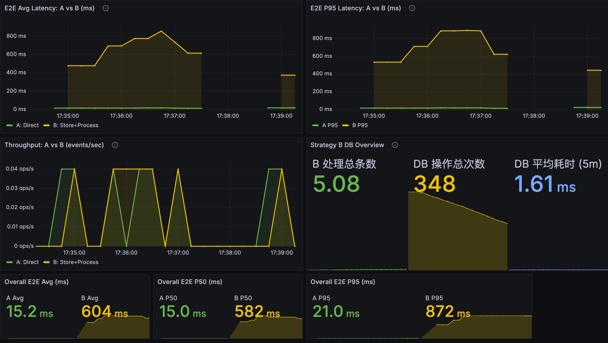
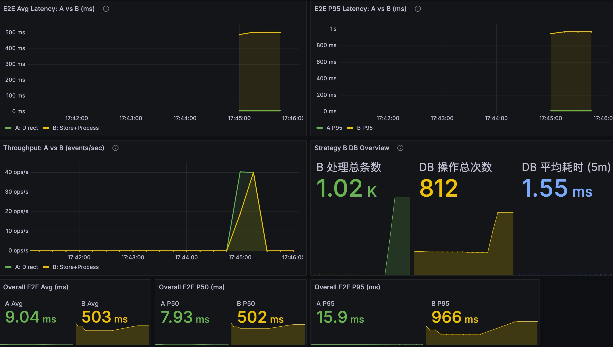
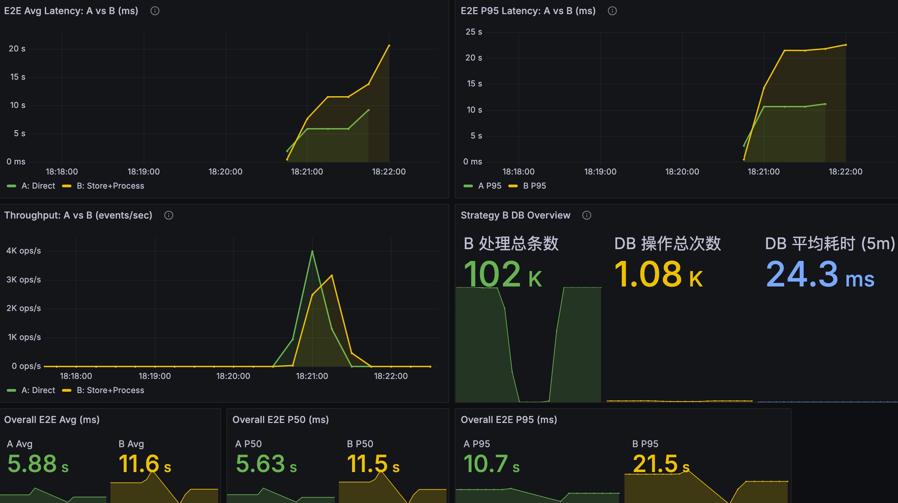
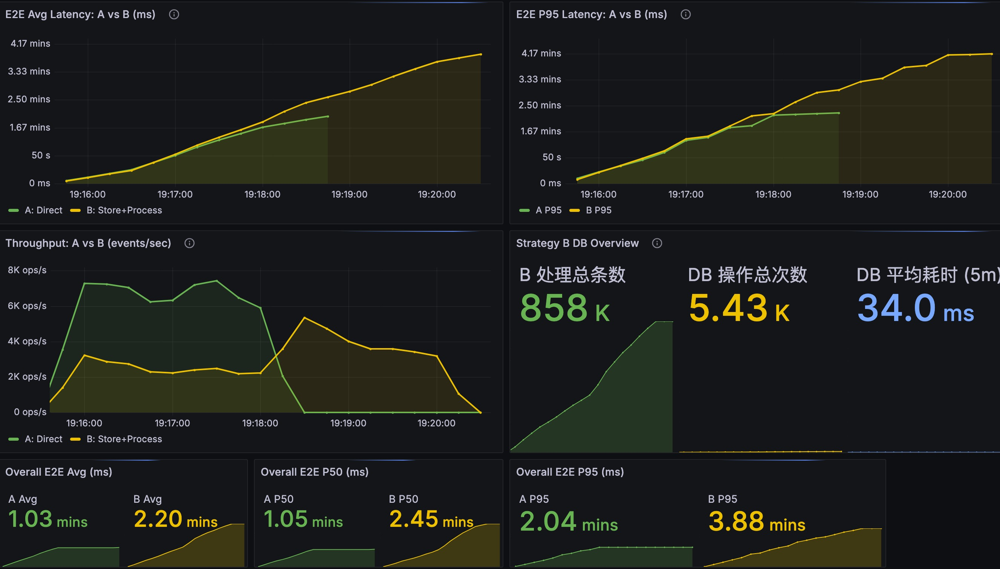

# POC 四轮压测结果总结（A vs B）

测试前提（4轮一致）：
- 模拟 DB 网络延迟：`0 ms`
- B 策略调度延迟：`1 s`
- 对比策略：
  - A = Direct
  - B = Store + Process

## 测试截图

> 图片均来自 `eventflow-sample/images/`。

### 第1轮（5次单次发送）

### 第2轮（1000条）

### 第3轮（10万条）

### 第4轮（超高压持续发送）

## 核心结果汇总

| 轮次 | 发送规模 | A Avg | B Avg | A P50 | B P50 | A P95 | B P95 | B处理总数 | B DB操作总次数 | B DB平均耗时(5m) |
|---|---:|---:|---:|---:|---:|---:|---:|---:|---:|---:|
| 第1轮 | 5次单条 | 15.2 ms | 604 ms | 15.0 ms | 582 ms | 21.0 ms | 872 ms | 5.08 | 348 | 1.61 ms |
| 第2轮 | 1000条 | 9.04 ms | 503 ms | 7.93 ms | 502 ms | 15.9 ms | 966 ms | 1.02k | 812 | 1.55 ms |
| 第3轮 | 100000条 | 5.88 s | 11.6 s | 5.63 s | 11.5 s | 10.7 s | 21.5 s | 102k | 1.08k | 24.3 ms |
| 第4轮 | 超高压持续发送 | 1.03 mins | 2.20 mins | 1.05 mins | 2.45 mins | 2.04 mins | 3.88 mins | 858k | 5.43k | 34.0 ms |

## 结论

1. 在低负载（第1轮、第2轮）下，A 延迟稳定在毫秒级，B 稳定在约 0.5~1 秒级，符合 B 依赖调度周期（1秒）的预期。
2. 在中高负载（第3轮，10万条）下，A/B 均进入秒级，且 B 约为 A 的 2 倍（Avg/P50/P95 均体现）。
3. 在超高压持续场景（第4轮）下，A/B 均进入分钟级，B 进一步高于 A（Avg 2.20 mins vs 1.03 mins，P95 3.88 mins vs 2.04 mins）。
4. B 的 DB 平均耗时随压力明显升高（1.55 ms -> 24.3 ms -> 34.0 ms），说明 DB 与调度链路在高并发下成为主要瓶颈来源。
5. 吞吐峰值随压力抬升（第3轮 A~4k/s、B~3k/s；第4轮 A~7k/s、B~5k/s），但延迟和排队快速放大，系统进入“高吞吐-高积压-高尾延迟”区间。

## 补充说明（口径）

- 图中 `B处理总数`、`DB操作总次数`、`DB平均耗时(5m)` 为近5分钟窗口聚合口径（按当前仪表盘定义）。
- 第1轮的 `B处理总数=5.08` 为窗口统计值，不是整数事件计数（属于速率/增量换算展示）。
- 第4轮为持续高压窗口，`B处理总数=858k` 为窗口统计值，不等同于单次请求固定发送总量。
